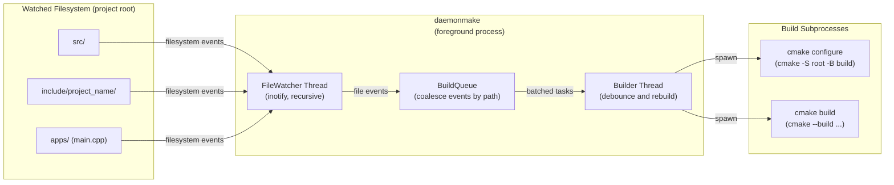

# daemonmake

## Table of Contents
- [daemonmake](#daemonmake)
  - [Table of Contents](#table-of-contents)
  - [Project Details](#project-details)
  - [Background](#background)
  - [Architecture (for Daemon)](#architecture-for-daemon)
  - [How to Use It](#how-to-use-it)
    - [Example of ideal project structure to apply daemonmake](#example-of-ideal-project-structure-to-apply-daemonmake)
  - [Design Goals](#design-goals)
  - [Non-Goals](#non-goals)
  - [Future Work](#future-work)


## Project Details
Status: v1 \
Language: C++20 \
Platform: Linux \
Build backend: CMake

`daemonmake` is a lightweight C++ developer tool that removes friction from the edit–build loop by running a foreground daemon that watches source files, coalesces changes, and triggers debounced rebuilds.

It infers project structure from conventions, generates and builds CMake projects, and runs a foreground daemon that watches files and automatically rebuilds on change using robust debouncing and coalescing. It is intentionally not a build system replacement — it delegates correctness to CMake/Ninja and focuses on iteration speed and developer ergonomics.


## Background
C++ development often involves repeated manual steps during iteration:
- invoking builds explicitly
- managing build directories and flags
- handling editor save bursts
- triggering too many or too few rebuilds

`daemonmake` focuses on the inner development loop:

Edit -> Save -> A correct build happens automatically.

Rather than replacing existing build systems, it integrates with them and provides a robust, low-friction workflow for day-to-day development.


## Architecture (for Daemon)


Key responsibilities
- FileWatcher
  - Uses inotify to watch project directories recursively
  - Dynamically adds watches for newly created directories
  - Detects overflow or invalidated watches and signals a safe fallback

- BuildQueue
  - Coalesces high-frequency filesystem events by path
  - Debounces rebuilds until a quiet period
  - Detects overflow and escalates to a full rebuild
  - Provides clean shutdown semantics for the daemon

- Builder
  - Re-discovers project structure on structural changes
  - Generates CMakeLists.txt if missing
  - Invokes CMake via a POSIX fork/exec subprocess wrapper
  - Runs builds serially to avoid overlap


## How to Use It
Initialize a project\
```daemonmake init```\
Creates a default config and prints discovered targets.

One-time build\
```daemonmake build```

Generate CMakeLists.txt (optional)\
```daemonmake gencmake```\
Only generates if missing (unless forced).

Run the daemon\
```daemonmake daemon```
- Runs in the foreground
- Watches src/, include/, apps/
- Automatically rebuilds on changes
- Press Ctrl+C to stop cleanly

### Example of ideal project structure to apply daemonmake
```
project_name/
├── src/                      # Library source files
│   ├── core/
│   └── util/
├── include/
│   └── project_name/         # Public headers
│       ├── core/
│       └── util/
└── apps/                     # Executable entry points
    └── main.cpp
```
- Each subdirectory under `src/` defines a library target.
- Headers under `include/project_name/<lib>/` are associated with that library.
- Each `.cpp` file under `apps/` defines an executable target.


## Design Goals
- Improve iteration speed during C++ development
- Require minimal upfront configuration
- Delegate correctness and dependency tracking to CMake
- Favor robustness over cleverness


## Non-Goals
- Replacing CMake, Ninja, or Make
- Perfect dependency inference
- Providing a fully hermetic or reproducible build system


## Future Work
- Building only affected targets and dependents
- Optional parallel build control
- Cross-platform filesystem watching